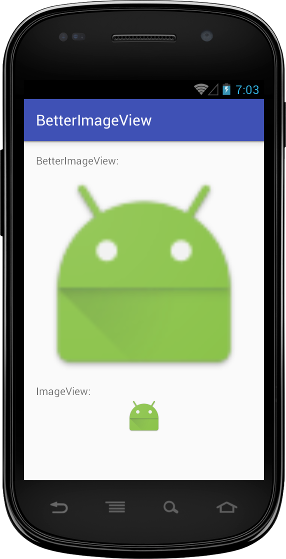

# BetterImageView

A "better" version of `ImageView`, which implements the API 18+ version of the `android:adjustViewBounds` attribute on API 17 and below. It also adds support for the `android:foreground` attribute to allow for such things as displaying a ripple on touch without the need to wrap the `ImageView` in a `FrameLayout`.

There are existing solutions to each issue individually (see the Credits section below), but I found myself wanting both behaviors frequently enough that I decided to combine them into a single widget.

*Note: for an explanation of why `adjustViewBounds` does not work as expected on API 17 and below, see [nuuneoi's article](http://inthecheesefactory.com/blog/correct-imageview-adjustviewbounds-with-adjustable-imageview/en).*

## Example



## Setup

##### Gradle

```groovy
compile 'com.wkovacs64:betterimageview:1.0.1'
```

##### Maven

```xml
<dependency>
  <groupId>com.wkovacs64</groupId>
  <artifactId>betterimageview</artifactId>
  <version>1.0.1</version>
</dependency>
```

## Usage

```xml
<com.wkovacs64.betterimageview.BetterImageView
    android:layout_width="match_parent"
    android:layout_height="wrap_content"
    android:adjustViewBounds="true"
    android:clickable="true"
    android:foreground="?attr/selectableItemBackground"
    android:src="@mipmap/ic_launcher" />
```

See the sample module for a complete example that demonstrates both features.

## Credits

Sittiphol Phanvilai - [AdjustableImageView](https://github.com/nuuneoi/AdjustableImageView)  
Jake Wharton - [ForegroundImageView](https://gist.github.com/JakeWharton/0a251d67649305d84e8a)  

Credit goes to Sittiphol and Jake as this is essentially a hybrid of their efforts.

## License

    Copyright 2015 Justin Hall

    Licensed under the Apache License, Version 2.0 (the "License");
    you may not use this file except in compliance with the License.
    You may obtain a copy of the License at

       http://www.apache.org/licenses/LICENSE-2.0

    Unless required by applicable law or agreed to in writing, software
    distributed under the License is distributed on an "AS IS" BASIS,
    WITHOUT WARRANTIES OR CONDITIONS OF ANY KIND, either express or implied.
    See the License for the specific language governing permissions and
    limitations under the License.
